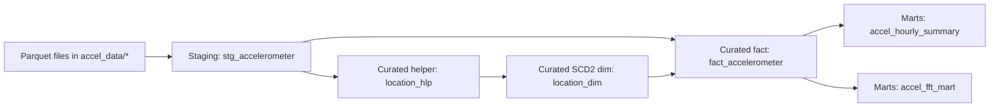
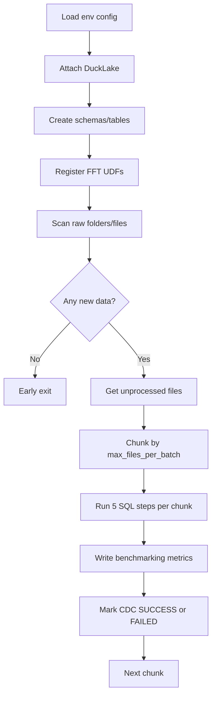
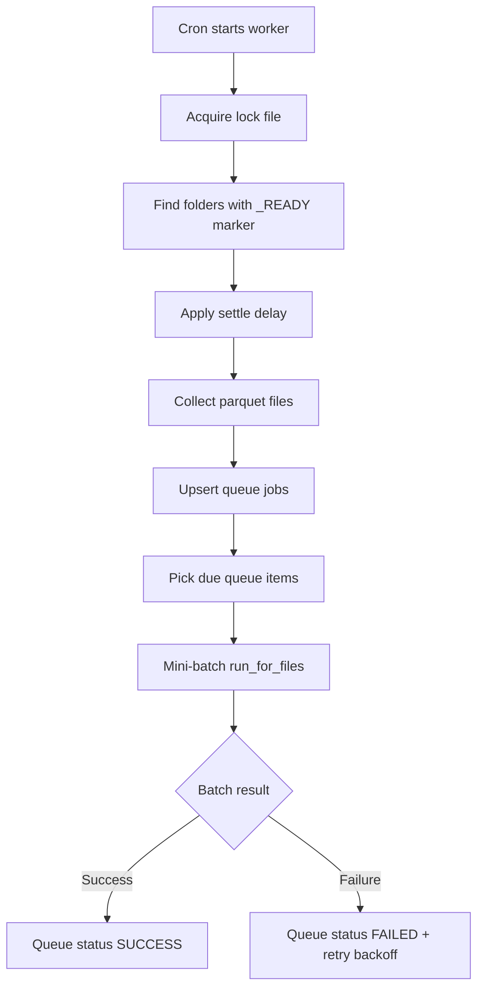
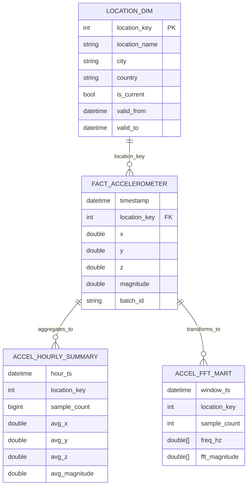

# Lakehouse RPi5 Pipeline

End-to-end accelerometer Lakehouse pipeline built on DuckDB + DuckLake, with:

- Layered SQL modeling (staging -> curated -> marts)
- CDC-style file tracking
- Step-level benchmarking
- Batch pipeline runner
- Realtime mini-batch queue worker

## Overview

This project ingests parquet accelerometer files, enriches location dimensions, builds fact tables, and publishes analytics marts (hourly summary + FFT).

Core implementation files:

- [run_pipeline.py](run_pipeline.py): batch orchestration, CDC filtering, benchmarking
- [realtime_queue_worker.py](realtime_queue_worker.py): cron-safe mini-batch queue worker
- [sql/staging/stg_accelerometer.sql](sql/staging/stg_accelerometer.sql)
- [sql/curated/accel_location_hlp.sql](sql/curated/accel_location_hlp.sql)
- [sql/curated/accel_location_dim.sql](sql/curated/accel_location_dim.sql)
- [sql/curated/accel_fact.sql](sql/curated/accel_fact.sql)
- [sql/marts/accel_summary_mart.sql](sql/marts/accel_summary_mart.sql)
- [sql/marts/accel_fft_mart.sql](sql/marts/accel_fft_mart.sql)

## Data Flow



## Batch Pipeline Flow



## Realtime Worker Flow



## Star Modeling Schema

Curated layer exposes the star-model core:

- Fact: `curated.fact_accelerometer`
- Dimension: `curated.location_dim` (SCD Type 2)

Marts derive analytical aggregates from the curated star.



## Operational Tables

- `staging.processed_files_cdc`: file-level CDC status and lineage
- `marts.pipeline_benchmark`: step timings, ingested rows, ingested bytes, errors
- `staging.realtime_job_queue`: queue/retry state for realtime worker

## Configuration

Main config files:

- [config/dev.env](config/dev.env)
- [config/prod.env](config/prod.env)

Useful keys:

- `data_path`
- `catalog_path`
- `ducklake_catalog`
- `ducklake_data_path`
- `staging_schema`, `curated_schema`, `marts_schema`
- `max_files_per_batch`
- `duckdb_memory_limit`, `duckdb_threads`, `duckdb_preserve_insertion_order`
- `ready_marker_name`, `worker_settle_seconds`
- `worker_max_files_per_run`, `worker_max_retry_attempts`, `worker_retry_delay_seconds`

## Run Commands

Batch pipeline:

```bash
python run_pipeline.py dev all
```

Realtime worker:

```bash
python realtime_queue_worker.py dev
```

With custom lock file:

```bash
python realtime_queue_worker.py dev --lock-file /tmp/realtime_worker.lock
```

## DuckDB Session Quickstart

```sql
INSTALL ducklake;
LOAD ducklake;
ATTACH 'ducklake:metadata.ducklake' AS my_ducklake (DATA_PATH 'ducklake_data');
USE my_ducklake;
```

If catalog already exists:

```sql
ATTACH 'ducklake:metadata.ducklake' AS my_ducklake;
USE my_ducklake;
```

## Notes

- Producer should create `_READY` as an empty file after all parquet files are finalized.
- Realtime worker intentionally ignores folders without marker or without settle delay.
- Mini-batching improves memory stability for heavy FFT workloads.
